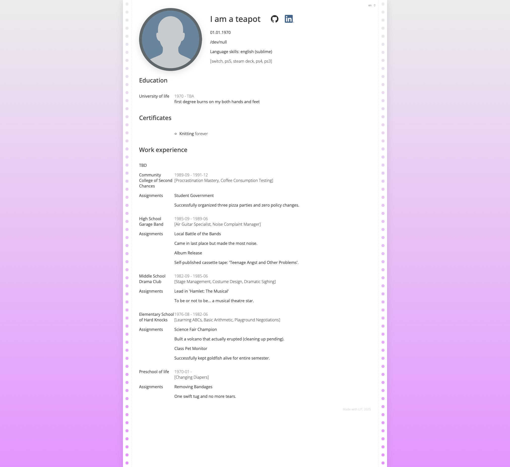

# CV

Curriculumn vitae project that renders cv JSON-file into html page using LIT web components.



## Development

```bash
# Copy example data
cp data/cv.example.json data/cv.json
```

```bash
# Build in watch mode
yarn build:watch
```

```bash
# Serve built bundle
yarn serve
```
